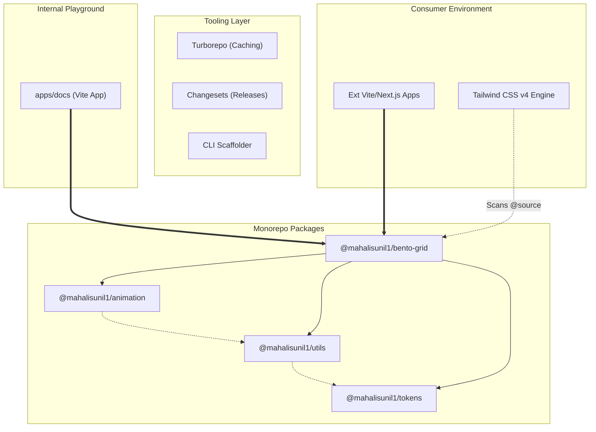

# System Architecture

This repository operates as an ultra-modern, high-performance UI component monorepo. It leverages a strict layered dependency structure to build rich, state-heavy React interfaces while guaranteeing instantaneous developer feedback loops and flawless consumer integrations.

## 1. High-Level Ecosystem

The monorepo strictly divides concerns between core primitives, independent structural packages, internal tooling, and the external world.



## 2. Core Philosophy: Extreme Encapsulation
We build robust **"Angular Material"** style components. Rather than shipping dozens of fragmented hook/state exports and demanding developers wire up GSAP themselves, we ship self-contained "Black Boxes".

For example, our `BentoGrid` securely hides complex GSAP slider loops and Promise-based data hydration behind a remarkably simple public API boundary:

```tsx
// Consumer sees purely superficial configuration properties
<BentoGrid enableMechanics={true} />
```
This isolates the messiness of React timings from the consumer, significantly improving their Developer Experience (DX).

## 3. Tooling & Infrastructure

### Turborepo
We utilize Turborepo (`turbo.json`) to intelligently cache all `build`, `typecheck`, and `lint` outputs. When combined with our standardized `.tpl` packages, it guarantees compiling the library takes milliseconds instead of seconds.

### Changesets
Instead of hand-rolling updates, Changesets systematically manages the semantic versioning schema (`pnpm changeset`) and performs automated global publishes to the NPM registry bounds (`pnpm release`).

### The Scaffolder
To ensure new components never stray from the architectural contract, they are exclusively generated via our custom CLI engine (`node scripts/create-component.mjs`). This automatically wires up the Turborepo scripts, instantiates the test beds, and updates the `registry.json` database.

## 4. Consumer Integration Protocol

Because we build for the modern era (Tailwind CSS v4 + Vite + React), consuming developers must implement a solitary configuration flag in their global styles:

```css
/* src/index.css */
@import "tailwindcss";
@source "../node_modules/@mahalisunil1"; /* Required for Tailwind to parse the UI library strings */
```

Once parsing is enabled, developers can cleanly run `pnpm install @mahalisunil1/<package>` and drop the components into any external workspace flawlessly.
